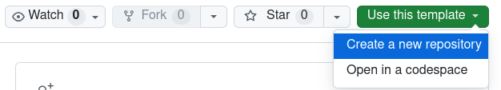
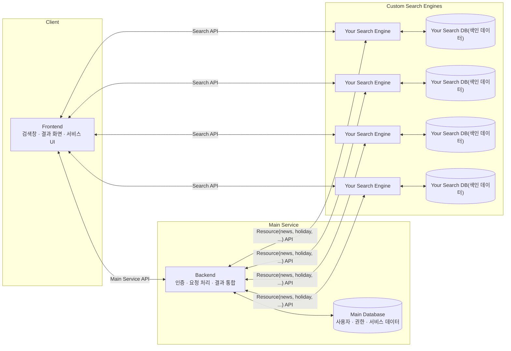

# SAVER 서비스 연동을 위한 템플릿

이 저장소는 [SAVER 서비스](https://saver.hufstech.com)에 본인의 검색엔진을 쉽게 연결하는 것을 돕고자 만들어졌습니다. 개발자는 각자 자기 Github로 가져가서 사용할 수 있는 템플릿을 이용해 본인의 코드를 쉽게 통합할 수 있습니다.



## 요약



* 프론트엔드와 본인의 검색엔진이 직접 소통하는 아키텍처로 개발.
* 본인의 검색엔진 코드를 통합하려면 이 템플릿의 기본 골격을 수정해야 한다. 검색엔진 코드는 `router.py`의 `search_work`에, 검색엔진의 데이터 반환 형식은 `model.py`의 `SearchResponse`에 작성한다.
* 외부 API을 사용해야 할 때, 요청 처리는 두 갈래로 나뉜다: 사용자가 요청할 때 보내기, 사용자 요청과 상관없이 보내기. 전자는 `router.py`의 `search_work`에 나와있듯이 호출하고, 후자는 `app.py`의 `lifespan`에 나와있듯이 주기 작업을 등록하면 된다. 상세 호출 코드는 `external_api.py`에서 확인할 수 있다.
* 비밀값을 포함할 때는 코드에 직접 넣지 않고, `.env` 파일을 만든 뒤 app.py에서 이를 불러와야 한다:
```dotenv
# .env
THIS_IS_SECRET=dhjkfahdskfaldhs
```

```python
# lifespan 함수 안에서
secret = os.getenv("THIS_IS_SECRET")
```

## Docker Compose로 실행

기본 Compose 구성은 애플리케이션만 실행합니다. 기본 설정을 바꾸려면 예제 환경 변수 파일을 복사한 뒤 값을 수정합니다.

```shell
cp .env.example .env
podman compose -f compose.yaml up --build
```

Docker를 사용하는 경우 두 번째 명령을 `docker compose -f compose.yaml up --build`로 바꾸면 됩니다. 컨테이너가 시작되면 [http://localhost:5055](http://localhost:5055)와 API 문서(`/docs`)를 사용할 수 있습니다. 이미 사용 중인 포트가 있다면 `.env`의 `APP_PORT`를 변경합니다.

실행을 종료할 때는 다음 명령을 사용합니다.

```shell
podman compose -f compose.yaml down
```

### PostgreSQL과 Valkey 예제 사용

`compose.yaml`에는 실제 실행과 healthcheck를 확인한 PostgreSQL과 Valkey 구성이 주석으로 들어 있습니다. 데이터베이스가 필요한 개발자는 다음 부분을 직접 주석 해제해야 합니다.

1. `compose.yaml`의 앱 환경 변수와 필요한 `depends_on` 항목
2. `compose.yaml`의 `postgres`, `valkey` 서비스와 해당 볼륨
3. `src/app.py`의 필요한 데이터베이스 연결 및 종료 코드
4. `src/router.py`의 해당 예제 엔드포인트

PostgreSQL과 Valkey의 호스트 포트는 보안을 위해 `127.0.0.1`에만 공개되도록 작성되어 있습니다. 포트가 이미 사용 중이면 `.env`의 `POSTGRES_HOST_PORT` 또는 `VALKEY_HOST_PORT`를 변경합니다. 이름 있는 볼륨까지 삭제하려면 종료 명령에 `--volumes`를 추가하며, 이 경우 저장된 데이터도 삭제됩니다.

주석을 해제한 뒤 다음 API로 연결을 확인할 수 있습니다.

```shell
curl -X POST http://localhost:5055/search/postgresql-example/podman
curl -X PUT 'http://localhost:5055/search/redis-example/greeting?value=hello'
```

## Python으로 직접 실행

```shell
python3 -m venv venv
source venv/bin/activate
pip install -r requirements.txt
```

아래 명령이 성공해야 합니다. README.md와 동일한 디렉토리 위치에서 실행해야 합니다.

```shell
uvicorn src.app:app --reload --host 0.0.0.0 --port 5055
```

브라우저에서 접속할 수 있는지 확인합니다: http://localhost:5055

본인의 애플리케이션을 테스트하려면 [http://localhost:5055/docs](http://localhost:5055/docs)로 접속하면 됩니다.


데이터베이스 연결은 현재 주석 처리되어 있습니다. 데이터베이스가 필요한 경우 `src/app.py`의 연결 및 종료 코드와 `src/router.py`의 해당 예제 엔드포인트를 함께 주석 해제해서 사용합니다.

* `POST /search/postgresql-example/{query}`: 예제 테이블을 만들고 검색어 한 건을 저장한 뒤 저장된 행을 반환합니다.
* `PUT /search/redis-example/{key}?value=...`: Valkey(Redis 호환)에 값을 5분 동안 저장한 뒤 다시 조회해 반환합니다.

## 검색 요청과 응답

> [!NOTE]
> 이 과정에서는 Pydantic, HTTPX를 비롯한 Python 외부 패키지 사용 코드가 들어있습니다. 이들 패키지 사용설명서는 [https://knowledge.opensource.ai.kr/s/saver/p/python-yZvdwO4DlX](https://knowledge.opensource.ai.kr/s/saver/p/python-yZvdwO4DlX)를 참고하세요.

```text
| src/
|   | app.py
|   | external_api.py
|   | model.py
|   | router.py
```

| 파일 이름 | 하는 역할 |
| --- | --- |
| app.py | FastAPI 실행을 위한 진입점 역할입니다. DB 연결 등의 코드가 있습니다. |
| external_api.py | 외부 API를 불러야 하는 상황에서 사용하는 httpx 라이브러리 코드 예시가 있습니다. |
| model.py | 단순히 json 원문으로 요청과 응답을 관리하면 유지보수성이 떨어집니다. Pydantic을 사용해서 요청과 응답 객체를 관리할 수 있으며, 그 기본 선언이 들어 있습니다. |
| router.py | 검색 작업을 처리하는 실제 코드가 들어 있습니다. |

router.py를 보면 `/search/work`라는 경로 처리 함수가 있습니다. 이 함수에 여러분의 검색엔진 코드를 넣으면 됩니다.

```python
@router.post("/work",
             response_model_by_alias=True,
             response_model=SearchResponse,
             status_code=status.HTTP_200_OK,
             summary="검색 작업",
             description=(
                     "사용자로부터 검색어를 입력받아 검색 작업 수행 후, 그 결과를 반환합니다."
             ),
             responses={
                 200: {"description": "검색 결과가 반환됨"},
                 422: {"description": "요청이 SearchRequest 형식으로 오지 않음"},
             },
             )
async def search_work(request: Request, search_request: SearchRequest):
    # 여기에 검색엔진 코드를 넣으세요.
    app = request.app  # app.state를 사용할 수 있게 해줍니다.
    external_api_response = await src.external_api.get_external_api(search_request) # 필요에 따라 사용하세요.
    return SearchResponse(**external_api_response)
```

* request 매개변수는 사용자 요청 원문을 담고 있을 뿐만 아니라, FastAPI app 객체를 사용할 수 있게 해줍니다. app.py에서 선언되는 app에는 DB를 포함해 다양한 코드를 포함할 수 있습니다.
* search_request 매개변수는 `saver.hufstech.com` 프론트엔드가 보내는 검색어 요청 객체입니다. 상세한 선언은 model.py에서 확인할 수 있습니다.
* 지금 예제에서는 get_external_api 함수에 요청을 보낸 후 그 결과로 얻은 json을 SearchResponse로 변환하여 사용자에게 전달하고 있습니다(json 응답을 예측가능하게 해주는 게 Pydantic의 역할이므로, get_external_api이 반환하는 json의 형태가 달라진다면 **SearchResponse도 반드시 수정해야 합니다**). 그렇다면 get_external_api 함수를 살펴보겠습니다.

```python
async def get_external_api(search_request: SearchRequest):
    """
    외부 API를 호출 할 때 사용하는 예시 코드입니다.
    """
    print(search_request)
    async with httpx.AsyncClient() as client:
        response = await client.get("https://saverapi.hufstech.com/") # 본인이 사용하는 API로 교체해야 합니다.
        response.raise_for_status() # API 호출에서 오류가 발생하면 get_external_api를 호출하는 라우터에서도 예외 처리가 발생합니다.
        return response.json()
```

* 검색엔진 중에 외부로 요청을 보내야 할 수도 있습니다. 이때 외부 API에 요청을 보내고 관리하는 Python 패키지가 `httpx`입니다. 이 함수는 현재 `saverapi.hufstech.com`로 요청을 보내고, 만약 실패하면 예외를 발생시키거나 성공하면 json을 반환합니다.
* 현재는 API 호출에 실패할 때 매우 간단하게만 처리하고 있습니다. `raise_for_status`는 편리하지만, 재요청이나 다른 방법으로 해결할 수 있을 때에도 검색 요청을 실패시키기에 주의가 필요합니다.
* 만약 API 호출에 비밀키가 필요한 경우, app.py에서 app 객체에 환경변수를 담는 예제가 있습니다. **절대로 코드에 비밀키를 포함하지 말고**, 이를 이용해야 합니다.

한편 사용자 요청과 별개로 API 요청을 보내고 싶을 수 있습니다. 이때는 Python에서 기본으로 지원하는 `asyncio`를 사용할 수 있습니다. 그 예제는 app.py에 있습니다.

```python
@asynccontextmanager
async def lifespan(app: FastAPI):
    # 백그라운드 태스크를 시작합니다.
    task = asyncio.create_task(periodic_task())
    
    yield # 여기 이후로 FastAPI가 종료된다고 보면 됩니다.
    
    # 앱 종료 시 백그라운드 태스크를 취소합니다.
    task.cancel()
    try:
        await task
    except asyncio.CancelledError:
        pass
```

* periodic_task 함수는 external_api.py에 있으며 앞선 예시와 크게 다르지 않습니다. 마찬가지로 본인이 사용하는 API를 호출하도록 변경해야 합니다.
* lifespan 함수는 FastAPI 애플리케이션의 전체 수명 주기를 관리합니다. yield 키워드 전에는 FastAPI가 시작하기 전에 할 일, 후에는 FastAPI가 종료되고 나서 할 일을 작성합니다. 프로그램이 종료되었으므로 asyncio로 예약한 periodic_task 작업도 취소해야 합니다.
